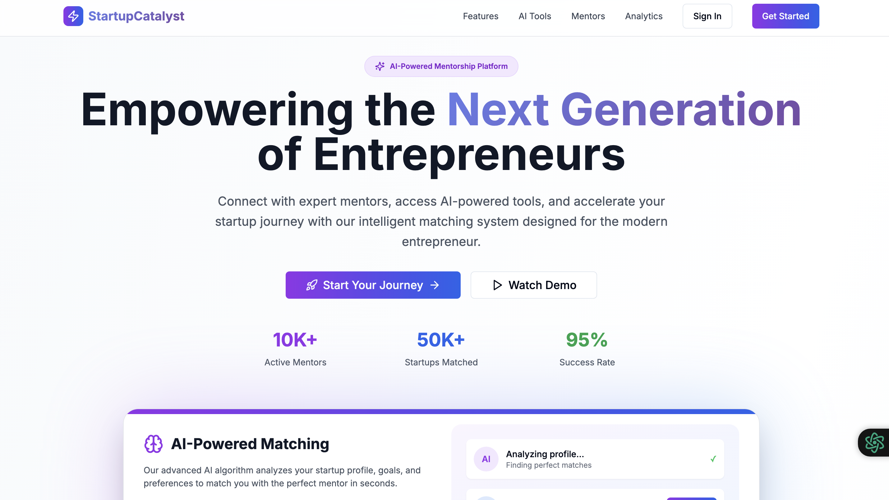

# Project_Mentorship
Developed an intelligent mentor-mentee matching system to automate pairings in public high schools based on multiple constraints. Designed for school counselors, this tool matches freshman mentees with upperclassman mentors using rules such as:

# 🚀 StartupCatalyst

Empowering the next generation of entrepreneurs with a unified platform for mentoring, startup tools, accessibility, and intelligent automation.

StartupCatalyst is a full-stack, AI-powered mentorship and resource platform tailored for early-stage startups and aspiring entrepreneurs. The platform aims to bridge the gap between innovators and the support systems they need—mentors, investors, knowledge, and government schemes—through a seamless, interactive, and multilingual experience.

Developed as part of the Smart India Hackathon, our solution addresses real-world problems faced by startups, especially those in Tier-2 and Tier-3 cities.

---


Link to project: https://v0-frontend-rosy-nu.vercel.app/
## 🧠 Features

- ✅ **Startup Verification System**  
  Automated validation using **GSTIN**, **CIN**, **PAN**, and **Patent IDs** to ensure verified users.

- 📄 **AI-Powered Pitch Deck Generator**  
  NLP-powered tool to convert startup descriptions into concise pitch decks.

- 🤖 **Mentor-Mentee Recommendation Engine**  
  AI-based personalized mentor mapping using cosine similarity and domain expertise.

- 🧑‍🏫 **Selective Mentoring Access**  
  Domain-specific mentoring with access controls based on expertise and startup maturity.

- 🎥 **Real-time Video Calling & Chat**  
  Built with WebRTC and Socket.IO for instant communication.

- 📊 **Interactive Analytics Dashboard**  
  Visualize user growth, mentor engagement, and startup progress using Plotly & D3.js.

- 🗺️ **Geo-Mapping of Bootcamps & Incubators**  
  Visual map of resources using Mapbox API and location intelligence.

- 🎙️ **VoiceBot Assistant**  
  Built using Dialogflow and Google Text-to-Speech API to assist users hands-free.

- 🧏 **Object & Sign Language Detection**  
  YOLOv7 and OpenCV-based real-time sign recognition and accessibility tools.

- 💬 **Social Features**  
  Post, comment, like, and connect with fellow innovators in a community feed.

- 🌐 **Multilingual Support**  
  Available in **English, Hindi, Marathi, Gujarati, Tamil** using i18n internationalization.

---

## 🛠️ Tech Stack

| Layer         | Technologies                                                                 |
|---------------|------------------------------------------------------------------------------|
| **Frontend**  | React.js, Redux, TailwindCSS, i18next, D3.js, Mapbox, WebRTC                 |
| **Mobile**    | React Native, Expo                                                           |
| **Backend**   | Node.js, Express.js, MongoDB, Firebase Auth, REST APIs                       |
| **AI/ML**     | Python, scikit-learn, TensorFlow, YOLOv7, OpenCV, Dialogflow, HuggingFace Transformers |
| **DevOps**    | Docker, GitHub Actions, Netlify (frontend), Heroku (backend), MongoDB Atlas |
| **APIs Used** | Mapbox, Twilio, Google Cloud TTS, Government Startup APIs, DigiLocker (future roadmap) |

---

## 📈 Future Roadmap

- 🤝 LLM-powered co-founder finder  
- 🏦 SIDBI and Startup India scheme integration  
- 💻 PWA development for low-connectivity usage  
- 🧏‍♂️ Full screen reader and accessibility compliance  
- 🔐 KYC integration via DigiLocker  

---

## 📂 Run Locally

```bash
# Clone the repository
git clone https://github.com/<your-org>/StartupCatalyst.git
cd StartupCatalyst

# Install dependencies
npm install

# Start the development server
npm run dev
